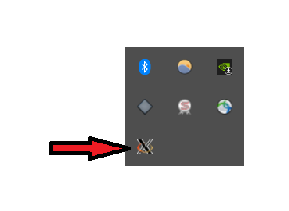
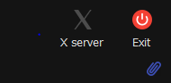
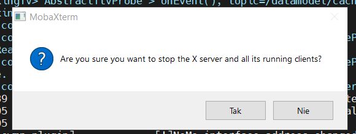
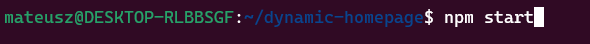

> 1.Configure repositories

- npm config set registry
  https://artifactory.tech.orange/artifactory/api/npm/npmproxy/

- npm config set \@orange-ra-dev:registry
  https://gitlab.tech.orange/api/v4/projects/179081/packages/npm/

- npm config set \--
  \'//gitlab.tech.orange/api/v4/projects/179081/packages/npm/:\_authToken\'
  \"\<your token with API level access\>\"

NOTE: Private repository for \@orange-ra-dev is subject to change in
case we start using more internally updated / developed libraries

2.  npm install && npm run build

3.  Run web server of your choice to host your build directory as \<your
    IP\>:8080/

For example: docker run \--name nginx -v
\"\$PWD\"/build:/usr/share/nginx/html:ro \--rm -p 8080:80 -d nginx (from
your project root directory)

4.  Define a new service named DH in
    /flash/Resources/Openweb/\*/\*/InteractiveServicesTable.json (if not
    already present), ensure the url points to your server

{

\"name\": \"DH\",

\"url\": \"http://\<your IP\>:8080/index.html\"

},

5.  W STB wpisz następującą komendę aby przejść do wybranego folderu i
    pobrać.

**cd /flash/Resources/Openweb/\*/\*/ && rm InteractiveServicesTable.json
&& wget **

**(tą operacje wykonujesz tylko raz na STB)**

6.  Sprawdź czy serwer (w moim przypadku nginx) odpowiada wpisując
    powyższy adres z kroku 4 w swoją przeglądarkę. Gdy strona nie rzuca
    błędem możesz przejść do następnego kroku, w przeciwnym wypadku
    należy sprawdzić, czy serwer został wystartowany.

7.  Uruchom serwer X(XLAUNCHER). W przypadku powodzenia zobaczysz go na
    swoim panelu ikon.

Jeśli używasz MobaXterm a XLAUNCHER nie odpowiada, sprawdź czy w
MobaXterm masz wyłączony serwer(włączony może powodować komplikacje
związane z uruchomieniem XLAUNCHERA który jest niezbędny do uruchomienia
web inspectora w następnym kroku.

8.  W swoim kliencie ubuntu (koniecznie na swoim koncie)

Należy wpisać następujące komendy, aby uruchomić web inspectora

\- export DISPLAY=\$(cat /etc/resolv.conf \| grep nameserver \| awk
\'{print \$2}\'):0

\- epiphany inspector://\[STB_IP_ADDRESS\]:2999

(adres ip STB znajdziesz w swoim narzędziu do zdalnego sterowania
np.MobaXterm wpisując ifconfig)

9.  Po uruchomieniu web inspectora, przejdź do sekcji Inspect a
    następnie zakładki Console i wpisz poniższą komendę w celu
    uruchomienia.

setActiveService(\'DH\', {pageExternalId: \'Home_Kids\'})

\*PODGLĄD ZMIAN W PRZEGLĄDARCE

Po każdej zmianie w projekcie, aby szybko podejrzeć zmiany w
przeglądarce należy wpisać poniższą komendę (folder z projektem)

\*URUCHOMIANIE PROJEKTU PO DOKONANIU ZMIAN\*

W przypadku gdy chcesz wprowadzone zmiany prześledzić na telewizorze
wykonaj **npm run build**, oraz zrestartuj STB komendą **reboot** lub
przyciskiem z tyłu boxa.

Po tych czynnościach cofnij się do kroku 7-8. W przypadku problemów wróć
do kroku nr 5.

\*URUCHOMIENIE PROJEKTU PO RESTARCIE KOMPUTERA\*

1\. sudo dockerd

2\. start serwera

3\. Patrz wyżej krok nr 6-9

\*OPCJONALNIE -- Jeśli chcesz wyświetlać zmiany bezpośrednio przez
telewizor\*

> 1.Add top menu entry, for example by putting public/topMenuConfig.json
> onto your box into /flash/Resources/topMenuConfig/\*/\*

cd /flash/Resources/topMenuConfig/\*/\* \# this actually works with the
stars

rm topMenuConfig.json \# or mv topMenuConfig.json topMenuConfig.json.bak

wget http://\<your IP\>:8080/topMenuConfig.json

2.  Reboot your stb, navigate to dh in top menu and press OK to launch
    the service.
